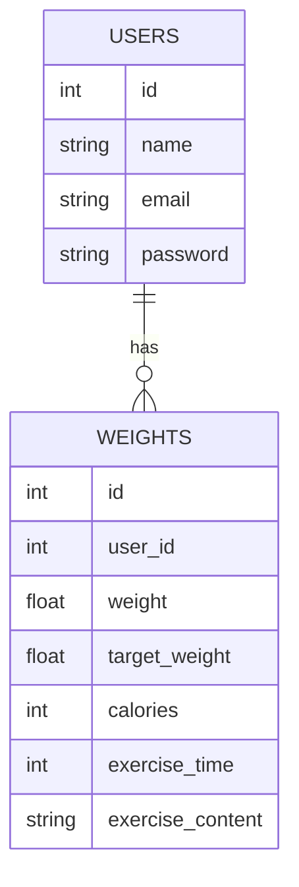

# Pigly

体重管理アプリです。

## 環境構築

### 前提環境

以下がインストールされていること

* PHP 8.1以上
* Composer
* Docker
* Docker Compose
* Node.js

---

### リポジトリのクローン

```bash
git clone https://github.com/自分のユーザー名/pigry.git
cd pigry
```

---

### Dockerコンテナ起動

```bash
docker-compose up -d --build
```

---

### コンテナに入る

```bash
docker-compose exec php bash
```

---

### Composerインストール

```bash
composer install
```

---

### .envファイル作成

```bash
cp .env.example .env
```

---

### アプリキー生成

```bash
php artisan key:generate
```

---

### マイグレーション実行

```bash
php artisan migrate
```

---

### シンボリックリンク作成

```bash
php artisan storage:link
```

---

### 動作確認

ブラウザでアクセス

```
http://localhost
```

---

## ER図


